<a href="https://github.com/modhamanish">
  <picture>
    <source media="(prefers-color-scheme: dark)" srcset="./dark.svg">
    <source media="(prefers-color-scheme: light)" srcset="./light.svg">
    
  </picture>
  

    <picture>
      <source media="(prefers-color-scheme: dark)" srcset="./dist/github-jet.svg">
      <source media="(prefers-color-scheme: light)" srcset="./dist/github-jet-light.svg">
      
    </picture>
  

</a>

---

<h2 align="center">📦 Published NPM Packages & Libraries</h2>

  
  

 

| Package | Badges | Description | Quick Install |
| :--- | :--- | :--- | :--- |
| <a href="https://www.npmjs.com/package/@modhamanish/rn-network-logger"><b>📡 @modhamanish/rn-network-logger</b></a> |   | In-app HTTP/HTTPS network logger and devtools inspector for React Native (iOS & Android). | `npm i @modhamanish/rn-network-logger` |
| <a href="https://www.npmjs.com/package/@modhamanish/rn-mm-template"><b>🚀 @modhamanish/rn-mm-template</b></a> |   | Production-ready React Native starter template with TypeScript, React Navigation v7, Reanimated v4, MMKV & i18n. | `npx @modhamanish/rn-mm-template init MyApp` |
| <a href="https://www.npmjs.com/package/@modhamanish/react-native-transformable-view"><b>🔄 @modhamanish/react-native-transformable-view</b></a> |   | Gesture-driven transformable view enabling intuitive drag, pinch-to-zoom, and rotate interactions on any component. | `npm i @modhamanish/react-native-transformable-view` |
| <a href="https://www.npmjs.com/package/@modhamanish/react-native-text-wrap-around-image"><b>📰 @modhamanish/react-native-text-wrap-around-image</b></a> |   | Magazine-style text wrapping around floating and circular images with WebView-powered styling. | `npm i @modhamanish/react-native-text-wrap-around-image` |
| <a href="https://www.npmjs.com/package/@modhamanish/rn-electric-border"><b>⚡ @modhamanish/rn-electric-border</b></a> |   | Animated neon & electric glowing border effects powered by React Native Skia and Reanimated. | `npm i @modhamanish/rn-electric-border` |

 

<b>🔍 Detailed Package Showcase & Highlights</b>

 

### 1. 📡 [`@modhamanish/rn-network-logger`](https://www.npmjs.com/package/@modhamanish/rn-network-logger)
> **Debugging & DevTools** • [GitHub Repository](https://github.com/modhamanish/rn-network-logger)
- Inspect outgoing HTTP/HTTPS requests & incoming responses in real-time.
- View headers, payload bodies, status codes, and timing metrics right inside the app.
- Zero extra native dependencies, lightweight, and works seamlessly with both iOS and Android.

---

### 2. 🚀 [`@modhamanish/rn-mm-template`](https://www.npmjs.com/package/@modhamanish/rn-mm-template)
> **Boilerplate & Architecture** • [GitHub Repository](https://github.com/modhamanish/mm-template)
- Built-in TypeScript configuration and scalable folder structure.
- Pre-configured with **React Navigation v7**, **Reanimated v4**, **MMKV Storage**, and **i18n Localization**.
- Jumpstarts modern React Native application development with best practices out-of-the-box.

---

### 3. 🔄 [`@modhamanish/react-native-transformable-view`](https://www.npmjs.com/package/@modhamanish/react-native-transformable-view)
> **Gestures & UI Interactions** • [GitHub Repository](https://github.com/modhamanish/react-native-transformable-view)
- Smooth multi-touch gesture handling (drag, pan, pinch to scale, and two-finger rotate).
- Ideal for sticker editors, image editors, canvas tools, and interactive UI elements.
- Powered by `react-native-gesture-handler` & `react-native-reanimated`.

---

### 4. 📰 [`@modhamanish/react-native-text-wrap-around-image`](https://www.npmjs.com/package/@modhamanish/react-native-text-wrap-around-image)
> **Rich Layout & Typography** • [GitHub Repository](https://github.com/modhamanish/react-native-text-wrap-around-image)
- Wrap long text seamlessly around images with custom float alignments (left, right, center).
- Supports circular image cutouts, custom padding, margins, and HTML/CSS rich styling via WebView.
- Perfect for editorial articles, news apps, and blog readers.

---

### 5. ⚡ [`@modhamanish/rn-electric-border`](https://www.npmjs.com/package/@modhamanish/rn-electric-border)
> **Graphics & Animations** • [GitHub Repository](https://github.com/modhamanish/rn-electric-border)
- Eye-catching glowing neon, lightning, and electric border pulse animations.
- High-performance 60/120 FPS rendering powered by **Shopify's `@shopify/react-native-skia`**.
- Fully customizable colors, glow intensity, noise frequency, and border radius.

---

  <b>Built with ❤️ by <a href="https://github.com/modhamanish">Manish Modha</a></b>

